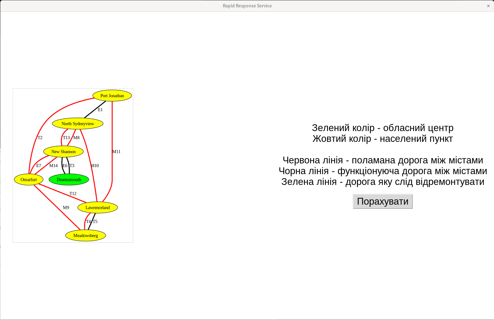
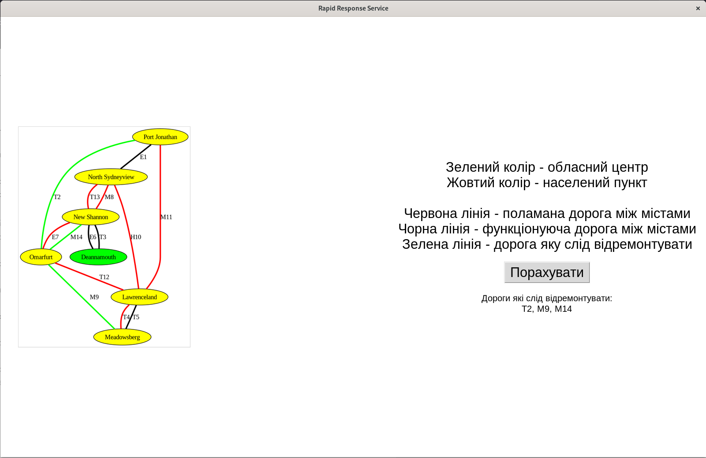

# Комп'ютерний проект: Служба Швидкого Реагування
## Розподіл роботи:
- Андрій Кривий: Command Line Interface, Звіт, Набори даних для тестування, Алгоритм пошуку кістякового дерева
- Іван Максимчук: Graphic User Interface, Алгоритм пошуку кістякового дерева
- Маргарита Падучак: Алгоритм пошуку компонент зв'язності, Алгоритм пошуку кістякового дерева, Презентація
- Юлія Пастернак: Робота з файлами, Презентація
- Теодор Талан: Робота з файлами
## Формат даних

Наш застосунок працює з даними у вигляді таблиць формату `csv`, а саме:

- Файл `map.csv`, який зберігає мапу області: першим рядком повинна бути назва міста - центра області. Далі ідуть рядки, які описують кожну дорогу у форматі `roadname, city1, city2, distance`, де `roadname` - назва дороги, `city1`, `city2` - назви міст, які з'єднує дорога та `distance` - довжина дороги в км. Мапа повинна бути зв'язним графом.
- Файл `damaged-roads.csv`, який зберігає усі пошкоджені на даний момент дороги у форматі `roadname, complexity`, де `roadname` - назва пошкодженої дороги та `complexity` - складність ремонту на 1 км дороги (чим більша складність, тим менш привабливим є ремонт цієї дороги).
#### Приклад
`map.csv`
```csv
Lviv
M14, Lviv, Mykolaiv, 41.2
M10, Mykolaiv, Stryi, 35.4
E43, Lviv, Stry, 124.7
```
`damaged-roads.csv`
```csv
E43, 23.6
```
Складність ремонту дороги `E43` буде складати `23.6*124.7 = 2942.92`.

## Алгоритм пошуку компонент зв'язності
Ми використовуємо пошук в глибину для пошуку компонент зв'язності, при цьому зберігаючи множину вже відвіданих міст. Проходячись по усім містам, ми запускаємо для них цей пошук, перевіривши чи ми їх ще не відвідали. Так, для кожного пошуку у нас утвориться множина міст, які належать до цієї компоненти зв'язності.

Після цього ми ітеруємось по усім зламаним дорогам, та перевіряємо чи вони зв'язують міста з різних компонент, якщо так, то зберігаємо про це інформацію.

Таким чином у результаті функції ми отримаємо компоненти зв'язності як множини міст, які входять у неї та дороги, які з'єднують різні компоненти.

## Алгоритм пошуку кістякового дерева
Ми використовуємо дані, отримані з функції пошуку компонент зв'язності. Кожну компоненту ми вважаємо за вершину нового графу, а дороги, що з'єднують їх - ребра. Тоді, використовуємо Алгоритм Прима для пошуку мінімального кістякового дерева.

Ми беремо першу в списку компоненту, додаємо її в список відвіданих та додаємо всі дороги з'єднані з нею в чергу.

Після цього опрацьовуємо дані з черги. Для кожної дороги ми дивимось з'єднані до неї компоненти, які ще не в списку відвіданих. Тоді додаємо усі з'єднані з ними дороги в чергу, а саму дорогу (якщо вона з'єднує хоча б одну невідвідану компоненту) в список доріг для ремонту.

Продовжуємо цей крок ітеративно, допоки черга не вичерпається.

## Робота з командним інтерфейсом
Командний інтерфейс реалізований за допомогою модуля `argparse`. Для отримання детальнішої інформації потрібно викликати команду `python cli.py --help`:
```
usage: Rapid Response Service, road services [-h] -m MAP_PATH -i
                                             DAMAGED_ROADS_PATH
                                             [-o OUTPUT_PATH]
                                             [-c COMPONENTS_PATH]

options:
  -h, --help            show this help message and exit
  -m MAP_PATH, --map MAP_PATH
                        Path to the csv file that contains the map in the form
                        of list of all roads, their distances and center city
                        name.
  -i DAMAGED_ROADS_PATH, --input DAMAGED_ROADS_PATH
                        Path to the csv file that contains list of damaged
                        roads and complexity of their repairment per km.
  -o OUTPUT_PATH, --output OUTPUT_PATH
                        Path to the output file, where list of roads that are
                        required to be repaired will be written. Default:
                        stdout
  -c COMPONENTS_PATH, --components COMPONENTS_PATH
                        Path to the output file, where list of isolated
                        regions will be written. Default: stdout
```
P.S. `stdout` - вивід у термінал

Приклади використання:
```bash
$> python cli.py -m examples/small-map.csv -i examples/small-damaged-roads.csv -o roads-to-recover -c isolated-regions
Successfully found isolated regions and stored to "isolated-regions"
Successfully found best strategy to recover roads and stored to "roads-to-recover"
```

```bash
$> python cli.py -m examples/small-map.csv -i examples/small-damaged-roads.csv
Successfully found isolated regions:
 - Deannamouth, New Shannon
 - Port Jonathan, North Sydneyview
 - Omarfurt
 - Lawrenceland, Meadowsberg

Successfully found best strategy to recover roads:
 - T2
 - M9
 - M14
```

## Робота з графічним інтерфейсом
Графічний інтерфейс реалізований на вбудованій бібліотеці `tkinter` з використанням зовнішніх бібліотек `pydot` та `Pillow` для роботи з графами та зображеннями відповідно.

`pydot` генерує рисунок графа, який зручно відображати за допомогою `Pillow` у вікні. Перед відображення ми також змінюємо розмір цього рисунка, щоб вмістити його у відповідні розміри вікна.

Перед використанням графічного інтефрейсу потрібно встановити залежності:
```bash
$> pip install Pillow pydot
```

Щоб запустити інтерфейс, потрібно викликати таку команду:
```bash
$> python gui.py
```

Під час запуску Вам запропонується обрати файл карти та файл пошкоджених доріг. Після цього відобразиться панель з відображеною мапою та кнопка `Порахувати`.



Після натискання цієї кнопки, програма здійснить розрахунок доріг, які найвигідніше відремонтувати та виведе їх, заодно відобразивши на карті.


